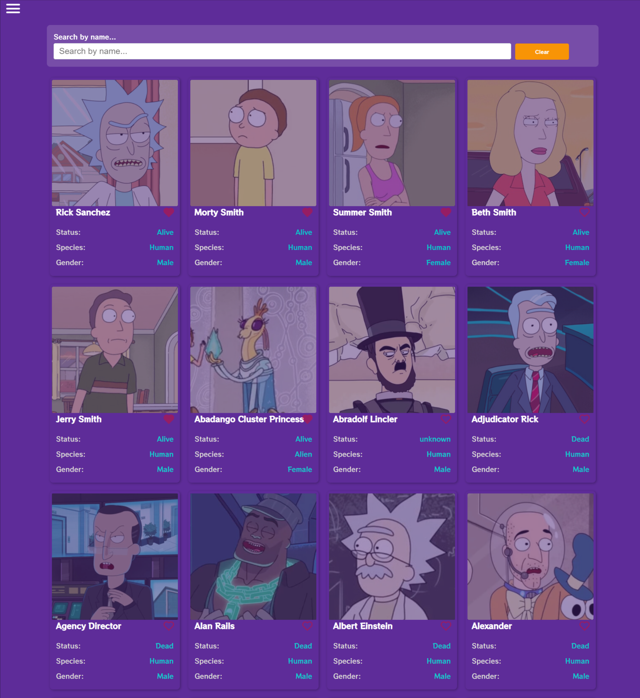

# RickandmortyGraphQLAPP

This project was generated with [Angular CLI](https://github.com/angular/angular-cli) version 12.2.18.

### DEMO: [RickandmortyGraphQLAPP](https://rickandmorty-graphql-angular.netlify.app/)



## Implemented Dependencies: 
* Apollo-angular
```
ng add apollo-angular
```
* nguniversal/express-engine
```
ng add @nguniversal/express-engine
```
* Ngx-Infinite-Scroll
```
  npm i ngx-infinite-scroll@13.0.1
```
* Ngx-Toastr
```
npm i ngx-toastr@14.1.1
```

## Note: 
### Install dependencies for running this project
```
npm install
```